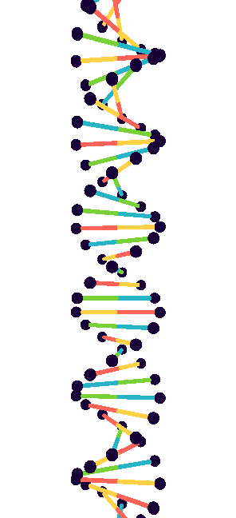
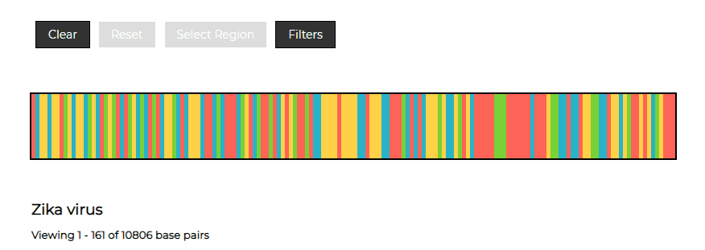
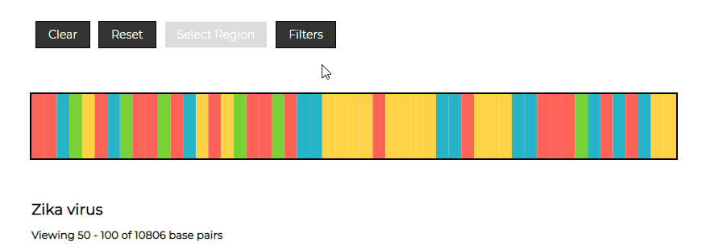
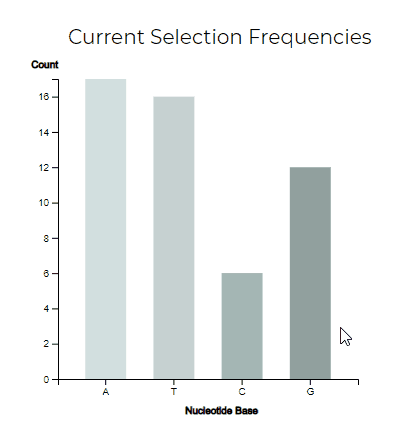
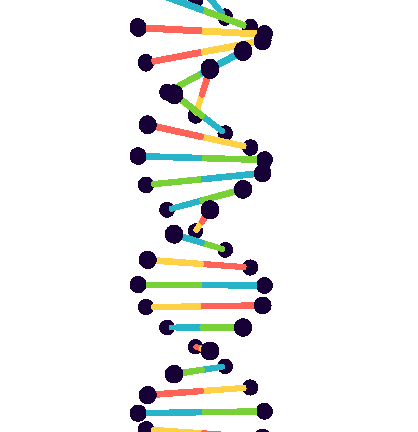

# DNA Visualizer

Closely examine the DNA sequence of various species and diseases through dynamic charts and 3D renderings.

[Live Demo](https://arctive.github.io/dna_visualizer/)

## Technologies
* HTML/CSS/JS
* D3.js for bar charts
* Three.js for 3D modelling

## Mobile support
This app is compatible with devices of all sizes and all OS's, and consistent improvements are being made.

## Features
### Regional selections
* Select specific regions of a sequence to examine in more detail.
<p align="center">
  
</p>

### Base filtering
* Filter the current selection by specific nucleotide bases.

<p align="center">
  
</p>

* When filtering, the selection sequence is redrawn to omit the unselected bases.
    The ```bases``` string variable contains letters of permitted bases. The total counts of each base is sent to the ```drawCharts``` function to update the bar graph.

```javascript
    for (let i = startIdx; i <= endIdx; i++) {
        if (bases.includes(this.mainSeq[i])){
            baseCounts[this.mainSeq[i]]++;
            ctx.fillStyle = baseColor[this.mainSeq[i]];
        } else {
            ctx.fillStyle = "#171717";
        }
        ctx.fillRect(this.rectWidth * (i - startIdx), 0, this.rectWidth, canvas.height);
    }
```

### Dynamic charts and models
* Bar graphs show the base composition of the current selection and of the total strand.
* Users can interact with a 3D model that is rendered based on the currently selected strand.

<p align="center">
  
  
</p>

* When a new selection is made, the raw sequence is sent to the ```Sequence``` object, which parses the string and counts the permitted bases. The string is sent to the ```immersion``` function to be rendered as a model, while the count is sent directly to the ```drawCharts``` function to build the bar graphs. This allows parsing to happen at a single location, and auxiliary functions render the data in real time.

### 3D modelling
* The 3D model is generated using the Three.js library. To replicate the helical nature of DNA, each level of 
    the model contains a row of shapes that are rotated at a fixed integer multiple of radians. This allows for consistent positioning 
    and spacing throughout the rendering, and by incrementing at an acute angle over time, the repetition creates a uniform helix 
    representative of a simplified DNA molecule.

```javascript
    row.position.y = i*2; //position of row height
    row.rotation.y = 30*i * Math.PI/180; //angle for helix
```

## Coming soon
* Touch interaction for the 3D model
* Detailed molecular structure
* More DNA sequences available for viewing